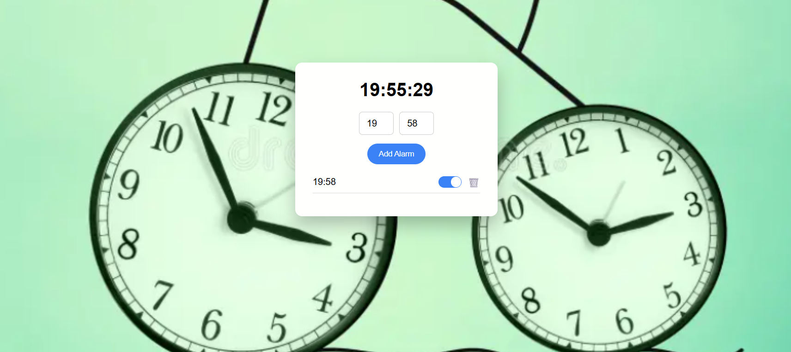

# Alarm Clock App

A simple web-based alarm clock that shows real-time hours, minutes, and seconds and lets users set, enable, and delete alarms.

## About

This is a browser-based alarm clock built using HTML, CSS, and JavaScript.  
Users can view the current time, set multiple alarms, toggle alarms on or off, and delete alarms.  
I built this project to practice working with time, events, DOM manipulation, and user interactions in JavaScript.

## Built With

`HTML` `CSS` `JavaScript`

## What I Learned

- How to work with real-time clocks using `setInterval()` and handle user actions like adding, enabling, and deleting alarms.

## Links

- [Live Demo](https://snehashrestha123.github.io/Alarm/)
- [Source Code](https://github.com/Snehashrestha123/Alarm)
